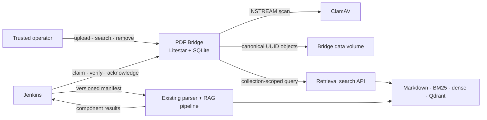

<p align="center">
  
</p>

<h1 align="center">PDF Bridge</h1>

<p align="center">
  <strong>Safe intake in. Verified RAG handoffs out.</strong><br>
  A small, auditable control plane between trusted PDF contributors and a scheduled retrieval pipeline.
</p>

<p align="center">
  
  
  
  
  
</p>

PDF Bridge gives trusted operators a collection-aware library, upload queue, search view, and
lifecycle ledger. It gives Jenkins an idempotent client and typed API for claiming
work, staging verified files, and reporting outcomes.

> [!WARNING]
> This is a network-restricted proof of concept, not an internet-facing upload service. ClamAV
> lowers risk; it does not make hostile PDFs safe. Before broader use, complete the controls in the
> [security and enterprise-gates review](docs/security.md).

**[Open the internal documentation wiki (OpenAI Sites)](https://pdf-bridge-field-guide.madsenjake0.chatgpt.site)**
· [Read the Playwright and ClamAV OSS review](docs/oss-review.md)

## At a glance

| Capability | What it proves |
|---|---|
| Operator workspace | Upload, cancel, retry, remove, search, and inspect append-only history |
| Guarded intake | Stream limits, PDF signature checks, SHA-256, duplicate detection, ClamAV, and atomic promotion |
| Corpus placement | Every upload selects an explicit collection that becomes immutable once queued |
| Jenkins handoff | Leased batches, immutable manifests, verified downloads, atomic staging, and replay-safe reports |
| Strict search | Invalid cross-collection, inactive, unknown, duplicate, or impossible results fail as a whole |
| Narrow ownership | The bridge keeps clean canonical bytes and catalog state; it never parses PDFs or writes to Qdrant |

## How it fits



The workflow is explicit: **choose collection → scan → store → queue → claim → verify → process →
report**. Ingestion either succeeds or fails. Parser conditions that prevent any required component
from succeeding are ordinary retryable ingestion failures. Deletion becomes final only after every
downstream removal is acknowledged and the canonical object is cleaned up.

See [Architecture and lifecycle](docs/architecture.md) for state diagrams, ownership boundaries,
and the internal dependency map.

## Quick start

PDF Bridge supports a **Linux host only**. You need Docker Engine with Compose and at least 4 GiB
available for ClamAV.

```sh
cp .env.example .env
# Replace both CHANGE_ME values with different random secrets of at least 32 characters.
docker compose up --build
```

Open <http://localhost:8000>. The first ClamAV start can take several minutes while signatures
download; watch readiness with:

```sh
docker compose ps
docker compose logs -f app clamav
curl http://localhost:8000/api/v1/health/ready
```

The app binds to loopback by default. PDF bytes and SQLite stay in the Docker-managed `bridge_data`
volume, outside the checkout. Development-mode [Swagger UI](http://localhost:8000/api/docs) and the
[OpenAPI contract](http://localhost:8000/api/openapi.json) start with the app.

For environment settings or an approved internal demo binding, use the
[configuration reference](docs/configuration.md). Do not run multiple app processes against SQLite.

## Jenkins handoff

Install an exact released wheel on a controlled Linux agent, inject the token through the Jenkins
credentials store, and pin the permitted hostname separately from the URL:

```sh
export PDF_BRIDGE_JOB_TOKEN="<injected-by-Jenkins>"
export PDF_BRIDGE_JOB_ALLOWED_HOST="pdf-bridge.internal"

pdf-bridge-job pull \
  --base-url https://pdf-bridge.internal \
  --allowed-host "$PDF_BRIDGE_JOB_ALLOWED_HOST" \
  --destination /srv/rag/pdf-bridge-handoff \
  --request-id "$BUILD_TAG" \
  --result-file pull-result.json

# The existing ingestion pipeline reads the staged manifest and writes report.json.
pdf-bridge-job report report.json \
  --pull-result pull-result.json \
  --base-url https://pdf-bridge.internal \
  --allowed-host "$PDF_BRIDGE_JOB_ALLOWED_HOST"
```

Retries with the same request ID are idempotent; a mismatch fails loudly. See the
[Jenkins handoff guide](docs/jenkins.md) and [example pipeline](Jenkinsfile.example) for the full
contract and credential guidance.

For existing indexed libraries, `pdf-bridge import-manifest` validates, hashes, scans, and copies
historical PDFs without modifying the source. See [Historical import and backup](docs/importing.md).

## Operational safeguards

| Boundary | POC behavior |
|---|---|
| Upload | Bounded streaming and ClamAV `INSTREAM`; scanner errors and malware fail closed |
| Storage | UUID paths outside the webroot, atomic promotion, no user-derived canonical paths |
| Browser | Protected session, same-origin mutations, CSRF tokens, trusted-host checks, no CORS |
| Automation | Separate bearer token, exact-host pinning, no redirects, batch-scoped downloads |
| Retrieval | Exact request/response correlation; invalid groups or hits are rejected in full |
| Container | Non-root, read-only root, dropped capabilities, `no-new-privileges`, one data volume |

Anonymous POC mode is not identity; collection labels are not end-user authorization; ClamAV is
not a parser sandbox or content-disarm system. Keep the service restricted and read the
[security review](docs/security.md) before evaluating deployment.

## Development and verification

Python 3.12 is required for a direct development environment:

```sh
python3.12 -m venv .venv
. .venv/bin/activate
python -m pip install -e ".[dev]"

python -m pytest
python -m ruff check .
```

The default suite uses temporary storage and fake providers. Opt-in checks exercise real Chromium
or a reachable `clamd` service:

```sh
python -m playwright install chromium
PDF_BRIDGE_RUN_BROWSER_TESTS=1 python -m pytest tests/test_browser.py

PDF_BRIDGE_RUN_CLAMAV_TESTS=1 \
PDF_BRIDGE_CLAMD_HOST=127.0.0.1 \
python -m pytest tests/test_clamav_integration.py
```

The ClamAV check needs current signatures and an already-running test daemon. Browser coverage
drives the live upload, queue, pipeline, search, theme, and cleanup workflows.

## Documentation

| Guide | Use it for |
|---|---|
| [Internal documentation wiki (private)](https://pdf-bridge-field-guide.madsenjake0.chatgpt.site) | Role-based guides for the browser, Jenkins, pipeline, platform, retrieval, security, and codebase |
| [Architecture and lifecycle](docs/architecture.md) | System boundaries, state machines, persistence, and batch semantics |
| [Configuration reference](docs/configuration.md) | Environment variables, collections, branding, storage, identity, and scanner settings |
| [Jenkins handoff guide](docs/jenkins.md) | Agent setup, manifests, reports, idempotency, and credentials |
| [Historical import and backup](docs/importing.md) | Version 2 import manifests, dry runs, migration, and recovery |
| [Operations runbook](docs/runbook.md) | Health checks, troubleshooting, upgrades, backups, and daily checks |
| [Security model and enterprise gates](docs/security.md) | Implemented controls, residual risk, ClamAV operations, and production prerequisites |
| [Playwright and ClamAV OSS review](docs/oss-review.md) | Licensing, maintenance posture, risk, alternatives, and Monday-ready decisions |

---

<p align="center"><sub>PDF Bridge is a deliberately narrow bridge: it makes the handoff visible, verifiable, and boring in the best way.</sub></p>
