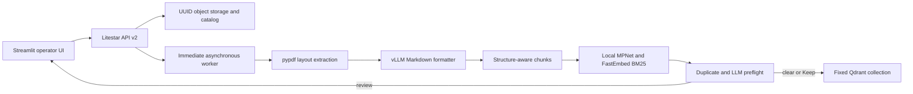

# PDF Bridge

Status: Current

PDF Bridge is a collection-based PDF storage facade with service-owned, real-time indexing. It
stores source PDFs under opaque UUIDs, exposes their immutable metadata and generated content to
operators, and publishes approved chunks directly to configured Qdrant collections. Jenkins and
the former ingestion pipeline are not part of the runtime.

The API-v2-only service, current persistence model, priority worker, fixed-collection Qdrant
integration, and Streamlit workspace are implemented in this repository. That code-completion
status does not assert that any deployed environment has completed the coordinated reset,
source-PDF reingestion, retrieval validation, or enterprise gates. Follow the
[reingestion procedure](docs/migration/historical-import.md) for an operational cutover.

## Product contract

- Deployment configuration defines the logical PDF collections and maps each one to a fixed,
  pre-provisioned Qdrant collection. Operators cannot create, rename, move, or delete collections.
- The filesystem remains the existing opaque UUID-sharded object store. Collection membership is
  catalog metadata, never a user-controlled filesystem path.
- Uploads are accepted asynchronously and begin preflight immediately on a best-effort basis. The
  expected peak is approximately five queued documents; this is not a batch system.
- After the bounded upload/malware admission gate, preflight performs native-text extraction,
  Markdown formatting, chunking, dense and sparse embedding, semantic screening, duplicate review,
  and LLM classification. These checks occur before ingestion.
- A clear preflight publishes automatically. Advisory findings enter `REVIEW_REQUIRED` for an
  explicit Keep, Replace, or Cancel decision.
- Ingestion is the direct publication of the exact immutable preflight artifacts to Qdrant. A
  document is `READY` only after its expected points are visible and verified.
- Deletion is immediate asynchronous work with priority over uploads: remove and verify Qdrant
  points first, then purge the PDF and private artifacts, then retain a content-free tombstone.
- Streamlit is the sole canonical operator interface. It provides collection and document browsing,
  upload/review/delete actions, read-only inspection of metadata, Markdown, and chunks, and an
  optional operator-only proxy to the separately owned retrieval service.

## Processing flow



Only English, native-text PDFs are supported. OCR and image-only documents are out of scope.
`pypdf` extracts layout-oriented text; a configured vLLM OpenAI-compatible chat-completions
endpoint converts bounded page groups or page slices into strict page-scoped Markdown JSON. Invalid
or incomplete formatting fails preflight—raw text is never silently substituted.

Dense vectors are generated inside PDF Bridge with
`sentence-transformers/all-mpnet-base-v2` (768 dimensions, cosine distance). One serialized
embedding lane protects process memory. Sparse vectors use FastEmbed `Qdrant/bm25`; document and
query encodings are deliberately distinct.

## Runtime boundary

PDF Bridge owns source storage, catalog state, generated artifacts, preflight, operator decisions,
Qdrant point writes, replacement, deletion, retry, and audit tombstones. The platform team owns
provisioning and lifecycle of fixed Qdrant collections. An external end-user retrieval service may
read published points, but its API, ranking, authorization, and user experience are outside this
repository. PDF Bridge may proxy that service for operator diagnostics; the proxy does not make
PDF Bridge the end-user retrieval product.

The v2 API is the only runtime API. `/api/v1` and the integrated Jinja operator UI are absent; there
is no compatibility adapter or dual-write period. Non-enterprise deployments expose the OpenAPI
JSON document at `/api/openapi.json`; enterprise mode disables it.

## Run and verify

Python 3.12 is required. Copy `.env.example` to `.env`, replace every placeholder independently,
point storage at an absolute non-synchronized directory outside the source tree, pre-seed the
pinned model cache, and have the platform owner provision every configured active Qdrant collection
plus the private screening collection with the required schema. Follow the
[Qdrant credential procedure](docs/configuration.md#qdrant) to keep its admin signing key out of
Bridge and issue the exact expiring collection-scoped JWT before startup.

```powershell
python -m venv .venv
.\.venv\Scripts\Activate.ps1
python -m pip install -e ".[dev,streamlit]"
alembic upgrade head
uvicorn pdf_bridge.app:app --host 127.0.0.1 --port 8000 --workers 1
```

Run Streamlit in a second shell:

```powershell
streamlit run streamlit_app/app.py
```

The API readiness endpoint is `GET /api/v2/health/ready`; Streamlit defaults to
`http://127.0.0.1:8000`. `docker compose up --build` starts the reference one-Bridge-process
topology and publishes Streamlit at `http://127.0.0.1:8501`. The isolated Streamlit container talks
only to API v2 and receives no storage, model-cache, or Qdrant access. Compose deliberately does not
create Qdrant collections or payload indexes; an empty Qdrant instance remains not ready until its
platform-owned fixed collections are provisioned.

```powershell
python -m ruff check .
python -m pytest -q
```

## Documentation map

- [Service contract](docs/service-contract.md) — authoritative behavior and lifecycle vocabulary
- [Architecture](docs/architecture.md) — components, persistence, work scheduling, and failures
- [API v2 contract](docs/contracts/intake-api.md) — current operator/service interface
- [Markdown, chunk, and Qdrant contract](docs/contracts/chunks-qdrant.md)
- [Historical refactor gap](docs/refactor-gap.md) and [implemented refactor plan](docs/refactor-plan.md)
- [Jenkins retirement](docs/migration/jenkins-retirement.md) and
  [coordinated reingestion](docs/migration/historical-import.md)
- [Configuration](docs/configuration.md), [operations](docs/runbook.md), and
  [security](docs/security.md)

Current documentation replaces prior contracts. Superseded behavior is available only through Git
history; there is no maintained legacy-documentation archive. The [security model](docs/security.md)
separately records controls that deployment owners must verify before production or enterprise use.
