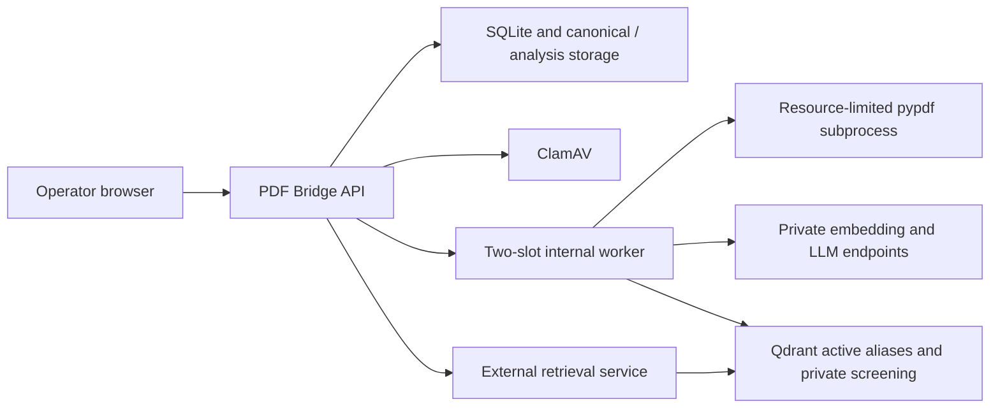

# PDF Bridge

PDF Bridge is a single-process Litestar service for safe, reviewable PDF intake into a
collection-partitioned retrieval system. It owns the durable upload, analysis, decision, indexing,
replacement, deletion, and cleanup lifecycle. There is no Jenkins handoff or batch consumer.

An upload is synchronously streamed, hashed, structurally checked, and scanned by ClamAV. Clean
bytes are promoted to canonical storage and returned as `202 Accepted`; a lifespan-owned worker
then extracts text, compares the document with active and pending content in the selected
collection, and either publishes it or asks an operator to choose Keep, Replace, or Cancel.

## Safety invariants

- Exact SHA-256 duplicates are rejected only inside the selected collection. The same bytes may
  legitimately exist in another collection.
- Filename, normalized-text, dense, BM25, LLM, contradiction, and provider-outage findings are
  advisory. A clear, complete analysis publishes automatically; any candidate or incomplete check
  enters `REVIEW_REQUIRED`.
- Encrypted, malformed, image-only, empty, text-insufficient, or over-budget PDFs are rejected
  without an override. OCR is not included.
- Pending chunks live only in the private screening index. Retrieval may query active aliases only.
- Replacement prepares the new analysis first, then deletes and verifies the old active points and
  artifacts, then publishes the new points. A temporary availability gap is accepted; old and new
  content must never be simultaneously active.
- Full analysis artifacts remain private for the document lifetime. Cancellation and deletion purge
  source bytes, analysis artifacts, and index points after recording a content-free manifest hash.

## Runtime shape



The supported topology is SQLite plus exactly one Uvicorn application process. The worker uses two
threads and process-local collection locks; multiple app processes or replicas are unsupported.

## Local container deployment

1. Copy `.env.example` to `.env` and replace every `CHANGE_ME` value.
2. Configure private OpenAI-compatible embedding and LLM endpoints, including exact model IDs and
   embedding dimension.
3. Start the pinned stack:

   ```bash
   docker compose up --build
   ```

4. Open `http://127.0.0.1:8000` unless the bind address or port was changed.

Compose runs Qdrant `1.18.1` on an internal-only network with API-key authentication and JWT RBAC.
PDF Bridge holds the administrative key because it creates collections, manages aliases, and writes
both active and screening indexes. External retrieval must receive a separate collection-scoped
read-only JWT that omits `pdf-bridge-screening-v1`; never give it the administrative key.

The application container runs one Uvicorn worker as a non-root user with a read-only root
filesystem. Startup applies the empty-reset Alembic migration before serving traffic.

## Intake API

The browser and JSON API share `/api/v1`:

| Endpoint | Purpose |
|---|---|
| `POST /uploads/preflight` | Return collection-scoped filename warnings |
| `POST /uploads` | Stream, scan, promote, and queue analysis; returns `202` |
| `GET /uploads?open=true` | Restore durable open work after refresh or restart |
| `GET /uploads/{id}` | Poll document, operation, phase, and analysis state |
| `GET /uploads/{id}/analysis` | Page through deterministic and LLM evidence |
| `POST /uploads/{id}/decision` | Submit Keep, Replace, or Cancel with an idempotency key |
| `POST /uploads/{id}/retry` | Retry retained failed work without a second semantic decision |
| `DELETE /uploads/{id}` | Cancel eligible unpublished work and queue cleanup |
| `GET /documents/{id}` | Read document detail and its audit ledger |
| `POST /documents/{id}/deletion` | Queue verified deletion of active content |
| `POST /search` | Proxy the stable external retrieval contract |

Upload and decision mutations require `Idempotency-Key`. Decision bodies contain only
`analysis_revision`, `action`, and, for Replace, `target_document_id`; there is no rationale field.

## Analysis and indexing

- `pypdf==6.14.2` runs in a child process with wall-clock, Linux CPU/address-space, page,
  normalized-character, and chunk limits. A limited subprocess reduces blast radius but is not a
  complete parser sandbox.
- `rapidfuzz==3.14.5` provides deterministic Unicode-aware filename-family warnings.
- Paragraph/sentence-aware chunks target 400 lexical tokens with 60-token overlap and a
  3,500-character hard cap. Defaults reject more than 2,000 pages, five million normalized
  characters, or 10,000 chunks rather than truncating.
- Dense vectors come from a configured private OpenAI-compatible endpoint. Sparse `content_bm25`
  and dense `content_dense` vectors are stored together under deterministic UUIDv5 point IDs.
- Candidate discovery searches active and screening indexes, applies deterministic thresholds, and
  fuses rankings with reciprocal rank fusion. Two independent temperature-zero structured-output
  calls add explanation-only evidence for the top 12 candidates.
- Every point carries schema, document, analysis, chunk, collection, page, text-hash, bounded-text,
  publication, and screening metadata. Active collections are physical epoch versions exposed by
  stable collection-key aliases; screening is private.

## Historical import

`pdf-bridge import-manifest` accepts only manifest version 3. It validates and scans each source PDF
and creates ordinary `ANALYZE` operations; it never synthesizes already-ingested rows.

```bash
pdf-bridge import-manifest historical-v3.json \
  --source-root /approved/source-pdfs \
  --dry-run \
  --actor-id change-1234

pdf-bridge import-manifest historical-v3.json \
  --source-root /approved/source-pdfs \
  --apply \
  --actor-id change-1234
```

See [historical import](docs/importing.md) for the strict manifest and recovery procedure.

## Development

Python 3.12 is required.

```bash
python -m venv .venv
. .venv/bin/activate
python -m pip install -e '.[dev]'
ruff check .
pytest -q
```

Browser tests require Playwright and its Chromium runtime. ClamAV integration tests require a live
daemon and remain separately marked.

## Streamlit workspace

A Streamlit operator front end covering the full intake lifecycle lives in
[`streamlit_app/`](streamlit_app/README.md). It is a pure HTTP client of a running PDF Bridge
service — it holds the same session and CSRF contract as the built-in browser UI and never opens
the catalog database directly.

```bash
python -m pip install -e '.[streamlit]'
streamlit run streamlit_app/app.py
```

## Documentation

- [Architecture and lifecycle](docs/architecture.md)
- [Configuration](docs/configuration.md)
- [Operations and cutover runbook](docs/runbook.md)
- [Security model](docs/security.md)
- [Historical import](docs/importing.md)
- [Open-source review](docs/oss-review.md)

This remains a coordinated proof-of-concept reset. Before production use, complete the security,
availability, evaluation-corpus, backup, retention, retrieval-authorization, and parser-isolation
gates in the linked documents.
