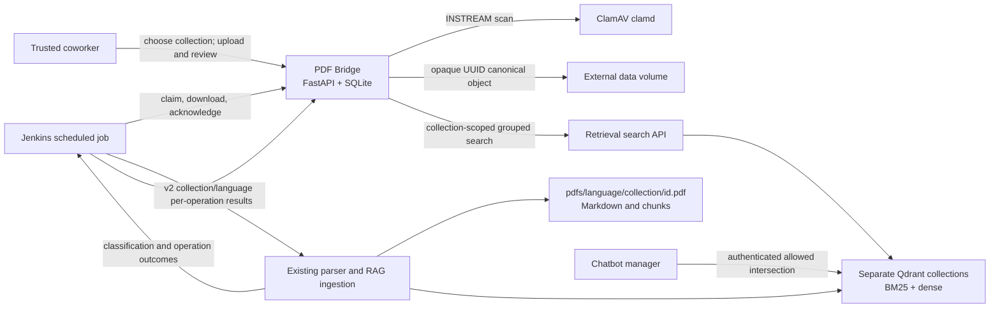
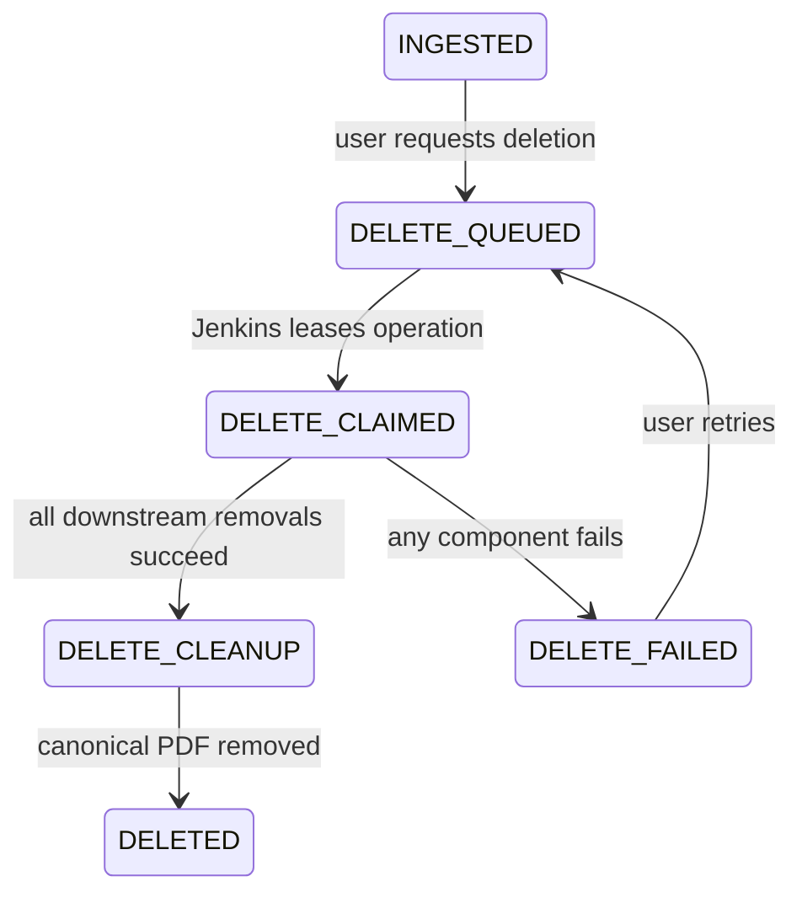

# Architecture and lifecycle

PDF Bridge is intentionally a boundary, not another retrieval system. It keeps the PDF catalog and
canonical clean bytes, exposes a small human UI, and hands explicit work to the existing scheduled
pipeline. Markdown, chunking, BM25, sentence-transformer embeddings, and Qdrant remain downstream.



## Ownership boundaries

PDF Bridge owns:

- uploaded PDF bytes after a clean malware scan;
- deployment-configured collection definitions and immutable document-to-collection placement;
- SHA-256, filename, size, language evidence, lifecycle, and pipeline metadata;
- queue operations, leased Jenkins batches, and audit events;
- the bridge document UUID that downstream chunks must retain as `document_id`.

The retrieval pipeline owns PDF parsing, English/French detection, markdown, chunking, indexes, and
search semantics. PDF Bridge does not add a JavaScript runtime or second parser: there is no V8,
Node, PDF.js, or `franc` dependency in the bridge process. Its canonical object key remains an
opaque UUID path; only the downstream RAG corpus uses
`pdfs/{language}/{collection_key}/{document_id}.pdf`.

The chatbot manager owns end-user retrieval authorization. A PDF Bridge `audience` label makes the
corpus boundary visible to operators but does not grant access. For every authenticated request,
the manager must intersect the requested collections with its server-side `allowed_collections`
before retrieval. This repository documents that invariant but does not implement the manager.

## Collection and search boundaries

`PDF_BRIDGE_COLLECTIONS` is the deployment registry. Each stable lowercase key is simultaneously:

- the PDF Bridge collection identifier;
- the Qdrant collection name; and
- the value used by chatbot-manager `allowed_collections`.

Every upload requires one configured collection and has no default. The destination is locked once
the document is queued; moving it requires deletion and re-upload. Startup fails when an active
catalog record references an unconfigured key, or when an unassigned active record is not held for
classification review.

The collection overview shows all configured corpora at once: explicit **Customer-facing** or
**Internal only** boundaries, available and processing totals, review-required totals, and
`en`/`fr`/`und` available-document counts. These are catalog counts; search-match totals come only
from the retrieval service.

Root search is count-only and requests every configured collection. The retrieval response must
contain exactly one group per requested key and an exact accepted-document total, including an
explicit zero. Entering a collection repeats the query as a hit-producing request scoped to that
one key. PDF Bridge rejects the whole response when query/mode/language/groups do not correlate,
when a hit is inactive or belongs to another collection/language, or when a reported total exceeds
the eligible catalog population. It never mixes partial upstream results with metadata fallback.

## Upload lifecycle

```mermaid
stateDiagram-v2
    [*] --> QUEUED: clean upload chooses collection; language is und
    QUEUED --> CANCEL_CLEANUP: user cancels before claim
    CANCEL_CLEANUP --> CANCELLED: canonical PDF removed
    QUEUED --> CLAIMED: Jenkins leases operation
    CLAIMED --> STAGED: verified batch acknowledged
    STAGED --> INGESTED: parser reports en/fr and indexes succeed
    STAGED --> CLASSIFICATION_REVIEW: parser reports safe und/review reason
    STAGED --> INGEST_FAILED: parser/service fails operationally
    INGEST_FAILED --> QUEUED: user retries with canonical PDF
    CLASSIFICATION_REVIEW --> QUEUED: legacy assign-and-detect or audited en/fr override
    CLASSIFICATION_REVIEW --> DELETE_QUEUED: operator removes document
```



The upload endpoint streams to a UUID-named temporary file, limits bytes while reading, calculates
SHA-256, checks the `.pdf` name and PDF signature, then sends the stream to ClamAV. Only a clean
file is atomically promoted into `objects/`. The bridge never parses it. The clean upload is queued
with `language=und`, `language_status=pending`, and its selected immutable collection.

After staging, the existing downstream parser inspects extracted text. A confident English or
French result allows indexing and becomes `detected`. A parser crash, timeout, or dependency outage
is `failed` and remains retryable. A content outcome such as `no_text`, `ocr_required`, `encrypted`,
`bilingual`, `unsupported`, or `low_confidence` is `review_required`: the pipeline must not write
BM25 or dense content. A legacy unassigned record can choose its collection and enter detection, or
receive an audited `en`/`fr` override. A pipeline-undetermined record retains its collection and
requires an audited override or removal; it cannot be repeatedly re-detected or moved.

## Deletion lifecycle



Deletion is staged, not optimistic. The final result must confirm removal from the pipeline's PDF
source, markdown output, BM25 index, and dense index. The bridge then records a recoverable cleanup
state, removes its retained canonical object, and marks the document `DELETED`. Cancellation uses
the same two-step cleanup pattern. A failed filesystem removal keeps the key and cleanup state so
the exact action/report can be retried safely. The audit tombstone remains.

## Batch handoff

1. Jenkins supplies a stable `request_id`; claiming again with it returns the same batch.
2. The bridge leases up to the requested limit of queued operations in one transaction.
3. Jenkins fetches the immutable version 2 batch manifest and downloads only `INGEST` items through
   batch-scoped URLs into the exact safe relative path
   `pdfs/{language}/{collection_key}/{document_id}.pdf`.
4. The client writes into a temporary sibling directory, checks declared length and SHA-256, writes
   its local versioned manifest, and atomically renames the complete directory.
5. Jenkins acknowledges the exact set of staged operation IDs. A partial set is rejected.
6. The external pipeline acts on every manifest item and sends one version 2 typed result per
   operation: `succeeded`, `failed`, or `review_required`, including classification where required.

Claim leases recover work when a job dies before staging. Staging and result calls are idempotent;
conflicting replays are rejected rather than silently changing history.

## Persistence

SQLite is appropriate only for this single-process POC. SQLAlchemy models and migrations avoid
SQLite-specific types so PostgreSQL remains a straightforward enterprise migration. The official
Compose topology uses one Uvicorn worker and one Docker-managed `bridge_data` volume. Running two
application processes against SQLite is unsupported.

Runtime storage contains:

```text
<storage-root>/
  catalog.sqlite3       metadata and audit events
  objects/              UUID-derived canonical PDFs
  temporary/            incomplete uploads/import copies
  quarantine/           reserved controlled quarantine location
```

Original filenames are display metadata only and never become storage paths.
The `pdfs/{language}/{collection}/{document_id}.pdf` tree belongs to the downstream handoff/RAG
store, not canonical bridge storage.
