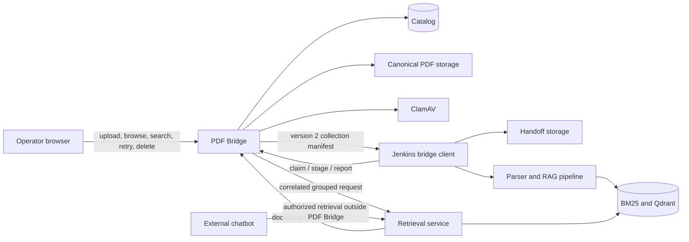
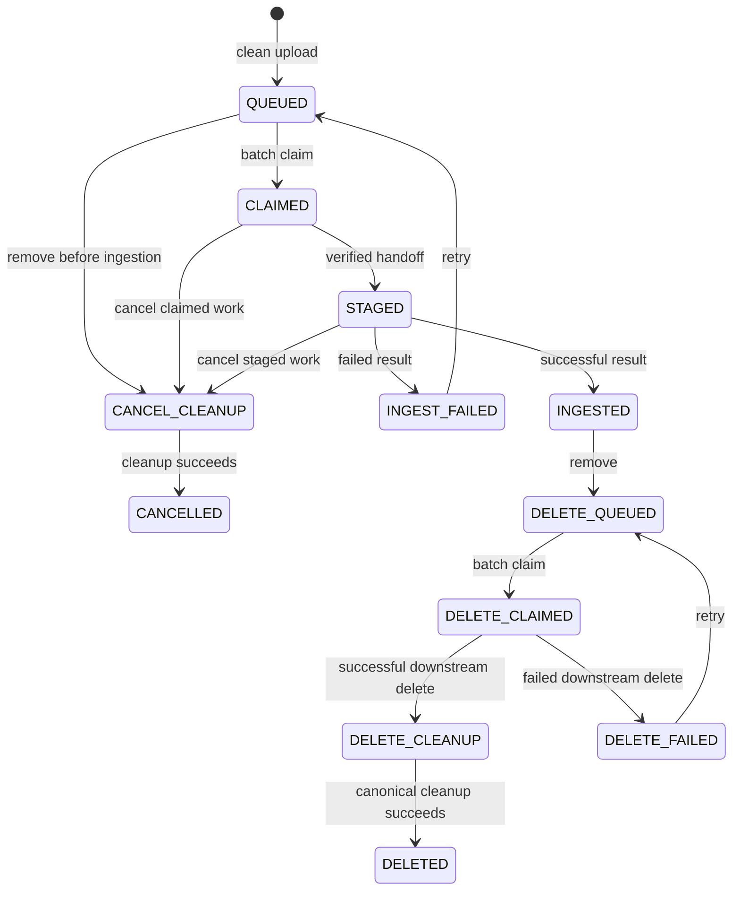

# Architecture and lifecycle

PDF Bridge is the catalog and control plane between operators, durable source storage, Jenkins, the
existing parser/RAG pipeline, and grouped retrieval. The bridge owns document identity and
lifecycle. The downstream pipeline owns derived artifacts and retrieval indexes.

## System boundary



Bridge search is an operator workspace feature. The external chatbot reaches the retrieval service
directly: its end-user authorization and answer generation happen outside PDF Bridge, which never
proxies or authenticates chatbot traffic.

The interfaces remain under `/api/v1`. Batch manifests, batch report files, and historical import
manifests remain version 2. Their version numbers are stable even though this disposable POC reset
changes the version 2 shapes atomically.

## Ownership

| Component | Owns | Does not own |
|---|---|---|
| PDF Bridge | UUID, collection, hash, canonical bytes, lifecycle, queue, audit history, retrieval eligibility | Parsing, derived artifacts, retrieval ranking, chatbot end-user authorization |
| ClamAV | Malware verdict for uploaded bytes | Document lifecycle or downstream ingestion |
| Jenkins client | Leasing, verified staging, pipeline invocation, complete result reporting | Catalog mutation outside the job API |
| Parser/RAG pipeline | PDF source copy, Markdown, chunks, BM25, dense/Qdrant data, downstream deletion | UUID or collection assignment |
| Retrieval service | Grouped ranking and pagination | Deciding which catalog documents are eligible |

Every integration carries the bridge document UUID and immutable `collection_key`. User filenames
are display metadata and never determine routing or identity.

## Application structure

Controllers translate HTTP and CLI requests. Managers coordinate use cases and own transaction
boundaries. Services implement storage, lifecycle, staging, and retrieval rules. Pydantic contracts
validate every public or job boundary. SQLAlchemy models in the persistence layer map the catalog;
there is no separate repository layer.

Dependencies point inward:

```text
controllers -> managers -> services -> persistence
                   |            |
                   +--> contracts <--+
```

Lifecycle mutation stays in the lifecycle service so web, API, CLI, and Jenkins paths cannot invent
different transitions.

## Persistence

The `documents` table stores:

- the bridge UUID, display filename, SHA-256, byte size, and canonical storage key;
- required immutable `collection_key`, including for deleted and cancelled tombstones;
- scan and lifecycle state, uploader identity, timestamps, errors, chunk count, and pipeline metadata.

The catalog also stores queue operations, batches and leases, component result rows, and audit
events. `ix_documents_collection_state` supports collection-scoped lifecycle queries. There are no
additional routing dimensions in the document schema.

Migration `0002_collection_partitioning` intentionally upgrades only an empty version-1 catalog.
If any version-1 document exists, the migration fails with a reset-required error instead of
guessing a collection. This is a disposable-catalog cutover, not a compatibility migration.

At startup, every document row must have a collection. Active documents must reference a configured
collection; historical tombstones keep their required collection even if that collection is later
removed from active configuration.

## Identity and storage

The bridge derives its canonical object key from the UUID, not from user input. Jenkins stages each
manifest item at exactly:

```text
pdfs/{collection_key}/{document_id}.pdf
```

The staged path must be relative, canonical, free of traversal, and consistent with both manifest
fields. The handoff tree and downstream corpus are independently disposable; they are not the
bridge's canonical storage.

## Document lifecycle



Ingestion has one binary operation result: success or failure. A successful result requires PDF
source, Markdown, BM25, and dense components all to be `succeeded`, and it forbids an error. A
failed result requires a nonblank error and enters `INGEST_FAILED`, where ordinary retry is
available. Encrypted files, OCR-only files, empty text, parser crashes, and component failures all
follow that same failure path when they prevent complete ingestion.

Deletion is available only through the normal lifecycle. An ingested document can be queued for
delete, and a failed downstream delete can be retried. Pre-ingestion removal uses cancellation and
cleanup; no alternate resolution workflow mutates document placement.

## Upload and duplicate handling

1. The operator chooses a configured collection and uploads a PDF.
2. The framework spools each multipart file part to bounded temporary storage while parsing the
   request. The bridge validates request bounds, copies the part into a private `quarantine/`
   staging file under the storage root while hashing the bytes and checking PDF shape, and invokes
   ClamAV on the quarantined copy. `temporary/` is reserved for historical import staging.
3. A clean PDF is promoted atomically from quarantine to canonical storage and receives an ingest
   operation.
4. Exact active duplicates return the existing document identity and collection without creating
   another operation.
5. Rejected or infected bytes never become available content.

The selected collection is required at creation and never changes.

## Batch handoff protocol

Jenkins claims work with an idempotent request identifier. A version 2 manifest item contains only:

- `operation_id`, `document_id`, `operation_type`;
- `filename`, `size_bytes`, `sha256`;
- `collection_key`, exact `relative_path`, and optional `download_url`.

Jenkins verifies staged bytes against size and SHA-256 before acknowledging every operation ID. A
batch result supplies `pipeline_run_id` plus exactly one entry per staged operation. Each entry has
`operation_id`, `success`, optional `chunk_count`, the four strict component results, and optional
`error`. Unknown, missing, duplicate, or extra operation IDs reject the report as a whole.

Batch aggregation contains only `succeeded` and `failed` counts. Empty claims, lease expiry,
idempotent replays, and cleanup recovery remain explicit states.

## Retrieval boundary

Search through PDF Bridge is operator-only: the operator API and web search use the same catalog
predicate — the document must be in an eligible lifecycle state and belong to the requested
collection. Chatbot authorization and generation remain outside the bridge. Eligible documents are `INGESTED`, `DELETE_QUEUED`,
`DELETE_CLAIMED`, and `DELETE_FAILED`; cleanup and tombstone states are excluded.

The bridge sends grouped requests to retrieval and validates the complete response before exposing
any hit:

- query, mode, requested group set, and pagination must correlate;
- every UUID must exist, be unique in the response, satisfy the shared eligibility predicate, and
  belong to the group collection;
- every group total must fit the corresponding eligible catalog population;
- duplicate hits, inactive or unknown UUIDs, cross-collection hits, missing groups, and impossible
  totals fail closed.

Qdrant payloads retain only the bridge `document_id` and `collection_key` needed for this
correlation. Retrieval does not accept or echo another document-routing field.

## Historical import

Historical import version 2 is an explicitly trusted administrative path. Each document declares a
source path, optional display filename, required collection attestation, and optional ingestion
metadata. The bridge validates the source, hashes it, creates the catalog record, and preserves the
same UUID/collection identity expected downstream. The manifest is strict: obsolete or unknown
fields are rejected.

## Atomic reset and cutover

The coordinated reset is performed in this order:

1. Confirm all source PDFs required for reingestion are available.
2. Stop bridge traffic and every job or handoff consumer.
3. Clear the disposable catalog, canonical storage, handoff storage, and Qdrant corpus.
4. Deploy the bridge, Jenkins client, parser/RAG pipeline, retrieval service, and UI contracts
   together.
5. Reingest the source set into configured collections using collection-only handoff paths.
6. Prove one ingested Qdrant item is searchable within its collection and deletable end to end.

Do not run old and new version 2 participants concurrently. There is deliberately no compatibility
shim.
