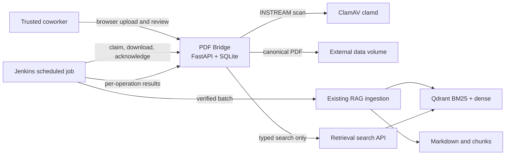
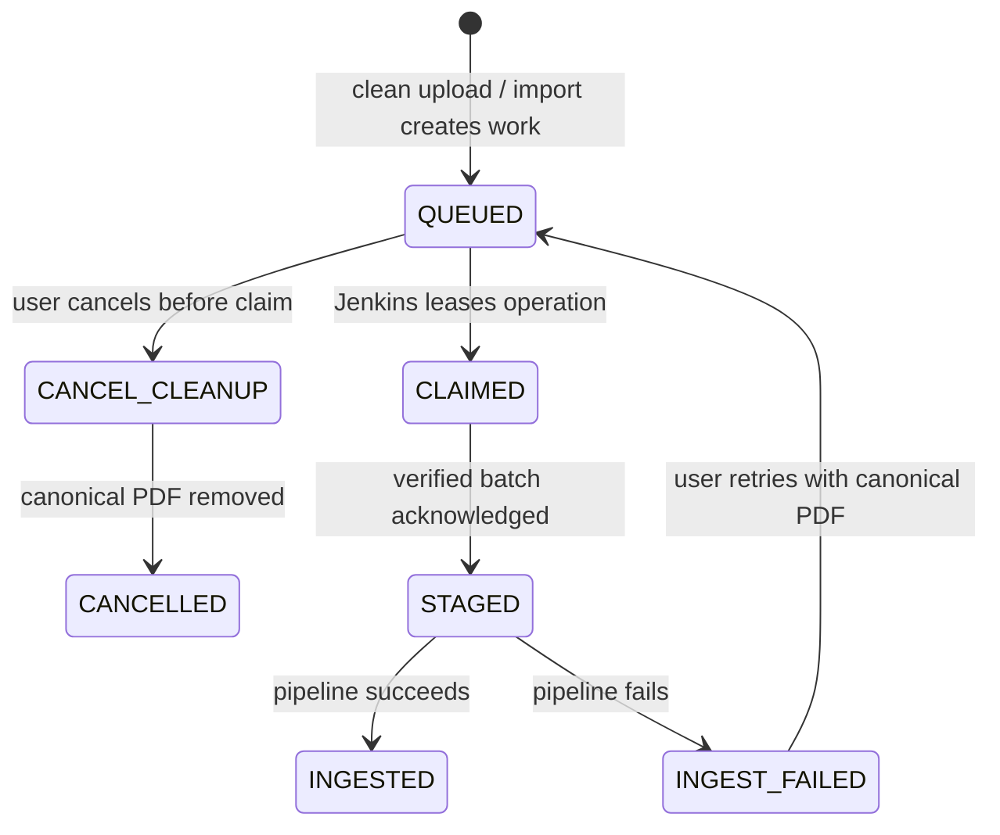
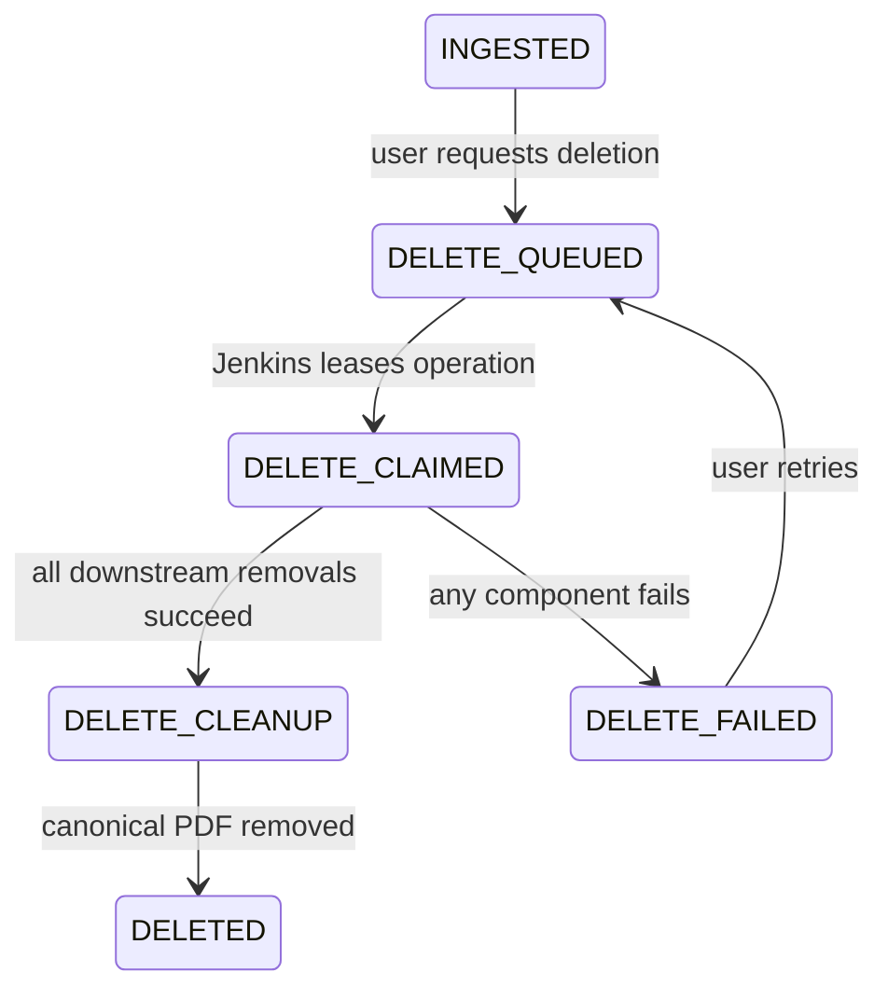

# Architecture and lifecycle

PDF Bridge is intentionally a boundary, not another retrieval system. It keeps the PDF catalog and
canonical clean bytes, exposes a small human UI, and hands explicit work to the existing scheduled
pipeline. Markdown, chunking, BM25, sentence-transformer embeddings, and Qdrant remain downstream.



## Ownership boundaries

PDF Bridge owns:

- uploaded PDF bytes after a clean malware scan;
- SHA-256, filename, size, lifecycle, and pipeline metadata;
- queue operations, leased Jenkins batches, and audit events;
- the bridge document UUID that downstream chunks must retain as `document_id`.

The retrieval pipeline owns PDF parsing, markdown, chunking, indexes, and search semantics. Its
search response is accepted only when every returned `document_id` exists in the bridge catalog.
PDF Bridge never falls back to filename search when the retrieval service is down.

## Upload lifecycle



The upload endpoint streams to a UUID-named temporary file, limits bytes while reading, calculates
SHA-256, checks the `.pdf` name and PDF signature, then sends the stream to ClamAV. Only a clean
file is atomically promoted into `objects/`. The bridge never parses it.

## Deletion lifecycle



Deletion is staged, not optimistic. The final result must confirm removal from the pipeline's PDF
source, markdown output, BM25 index, and dense index. The bridge then records a recoverable cleanup
state, removes its retained canonical object, and marks the document `DELETED`. Cancellation uses
the same two-step cleanup pattern. A failed filesystem removal keeps the key and cleanup state so
the exact action/report can be retried safely. The audit tombstone remains.

## Batch handoff

1. Jenkins supplies a stable `request_id`; claiming again with it returns the same batch.
2. The bridge leases up to the requested limit of queued operations in one transaction.
3. Jenkins fetches the immutable batch manifest and downloads only `INGEST` items through
   batch-scoped URLs.
4. The client writes into a temporary sibling directory, checks declared length and SHA-256, writes
   its local versioned manifest, and atomically renames the complete directory.
5. Jenkins acknowledges the exact set of staged operation IDs. A partial set is rejected.
6. The external pipeline acts on every manifest item and sends one typed result per operation.

Claim leases recover work when a job dies before staging. Staging and result calls are idempotent;
conflicting replays are rejected rather than silently changing history.

## Persistence

SQLite is appropriate only for this single-process POC. SQLAlchemy models and migrations avoid
SQLite-specific types so PostgreSQL remains a straightforward enterprise migration. The official
Compose topology uses one Uvicorn worker and one Docker-managed `bridge_data` volume. Running two
application processes against SQLite is unsupported.

Runtime storage contains:

```text
<storage-root>/
  catalog.sqlite3       metadata and audit events
  objects/              UUID-derived canonical PDFs
  temporary/            incomplete uploads/import copies
  quarantine/           reserved controlled quarantine location
```

Original filenames are display metadata only and never become storage paths.
