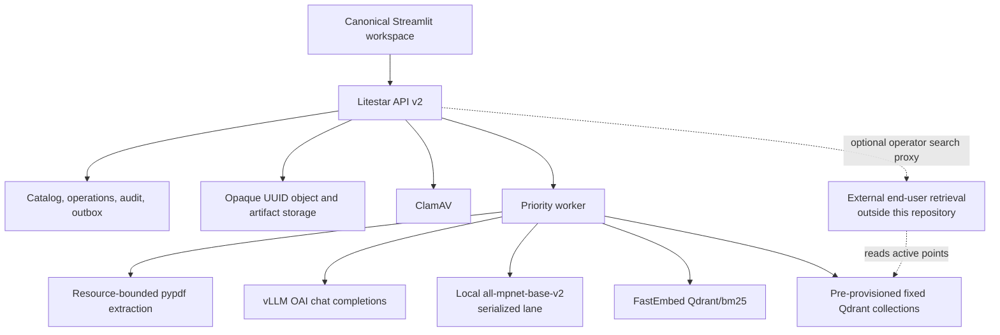

# Architecture

Status: Current

PDF Bridge is a single service boundary around collection-based PDF storage and direct Qdrant
publication. The catalog is authoritative for lifecycle; Qdrant is a derived active index; the
filesystem is an opaque content store.

## Component boundaries



| Component | Owns | Must not own |
|---|---|---|
| Streamlit | Operator navigation, upload/review/delete workflows, inspection rendering | Direct filesystem, catalog, model, or Qdrant access |
| Litestar API v2 | Authentication, validation, resources, lifecycle mutations, read gating, optional operator search proxy | HTML operator experience or end-user retrieval ranking/authorization |
| Catalog/storage | Durable identity, state, source bytes, prepared revisions, audit and tombstones | User-controlled paths |
| Worker | Preflight, publication, replacement, deletion, recovery | Collection provisioning or hidden fallback behavior |
| vLLM | Strict Markdown formatting and retained preflight classification/verifier calls | Decisions, catalog state, chunking, or indexing |
| Qdrant | Fixed active and private-screening point persistence | Catalog authority or collection lifecycle initiated by Bridge |
| Platform | Qdrant collection creation, schema, credentials, backup, and capacity | Document lifecycle |

Jenkins, handoff folders, batch manifests as ingestion boundaries, callbacks from an external
pipeline, and ingestion reports are not components of this architecture.

## Persistence and identity

The catalog stores logical collection definitions, document UUIDs, immutable source metadata,
lifecycle state, operation leases, prepared revision manifests, review evidence and decisions,
publication outbox entries, deletion progress, and append-only audit events.

The storage root has service-owned UUID-addressed objects and protected, size-bounded compressed
provider exchanges. Prepared page, Markdown, chunk, vector, and validated evidence records are held
in the catalog. The storage layout is:

```text
objects/{uuid_prefix}/{document_uuid}.pdf
artifacts/{document_uuid}/{prepared_revision_uuid}/...
```

This layout is not a public interface. Original filenames, collection keys, headings, and document
titles are metadata only and are never interpolated into paths. `uuid_prefix` is the managed shard
derived from the document UUID by `storage_key_for`; it is not collection- or user-derived. A
prepared revision contains:

- per-page `pypdf` layout text and its hash;
- strict page/slice formatter requests and responses, their hashes/diagnostics, and validated
  Markdown;
- canonical Markdown and page map;
- ordered chunks, provenance, dense vectors, sparse document vectors, and hashes;
- parser, formatter, chunker, dense-index, sparse-index, and preflight-policy profiles;
- deterministic candidates, validated LLM evidence, and protected advisory prompts/raw responses.

Artifacts become immutable when preflight completes. A retry before completion creates a new
revision attempt; any material input/profile change likewise creates a new revision. Publication
never mutates or recomputes an approved revision.

## Collection topology

Deployment configuration maps each logical collection key to exactly one fixed active Qdrant
collection name. A separate fixed, private screening collection holds pending prepared points so
concurrent uploads can be compared. All names are pre-provisioned and explicit; aliases, epochs,
derived names, and dynamic collection creation are forbidden.

At startup/readiness, Bridge verifies:

- the formatter model is available and `/tokenizer_info` reports the exact deployment-pinned
  tokenizer class;
- every configured collection exists and no two keys map to the same active name;
- every configured target can be attested as a physical collection with no alias participation;
- dense vector `dense` is 768-dimensional cosine;
- sparse vector `bm25` is configured for the supported FastEmbed BM25/IDF shape;
- required payload indexes exist;
- the screening collection is distinct from every active collection.

Schema drift fails readiness. Bridge may read collection descriptions and alias metadata and may
upsert/delete document points, but it does not mutate collection or alias topology. Deployment
acceptance separately proves the credential's point permissions and denial of collection
administration. External retrieval credentials and behavior remain outside Bridge; screening must
never be available to that consumer.

## Intake and preflight data flow

1. API v2 validates collection membership and request bounds, streams and hashes the upload,
   validates PDF shape, scans it, promotes it to UUID storage, records `PREFLIGHTING`, and commits a
   high-durability operation.
2. The worker extracts English native text page-by-page with `pypdf` layout mode under page,
   character, memory, CPU, and wall-clock limits. It rejects unsupported inputs rather than OCR.
3. Consecutive pages are packed within the vLLM prompt budget. A page that cannot fit is divided
   into deterministic ordered slices. The strict response must cover every page/slice exactly once.
4. Validated Markdown is assembled in page order, chunked with structural provenance, and embedded:
   local MPNet produces normalized 768-dimensional dense vectors and FastEmbed produces BM25
   document vectors.
5. Screening points are upserted to the fixed private collection. Candidate discovery queries both
   the selected active collection and same-collection screening points, using dense vectors and
   BM25 **query** encoding for searches.
6. Deterministic duplicate evidence and retained LLM classifier/verifier evidence are persisted.
   Clear complete results proceed automatically; all candidates or incomplete advisory checks enter
   `REVIEW_REQUIRED`.
7. Approval binds the prepared revision and its persisted active Qdrant collection target.
   Publication stages its exact chunk payloads/vectors as non-retrievable `publishing` points,
   verifies them, opens and verifies the active visibility gate, removes its screening points, and
   marks `READY`.

No external call occurs inside a catalog transaction. Durable operations, deterministic point IDs,
and an outbox make every Qdrant mutation replayable after process failure.

## Scheduling and concurrency

The implementation supports low concurrency: approximately five queued documents at peak. One service
process owns a two-slot priority worker. Work classes are ordered `DELETE`, replacement-old-delete,
`PUBLISH`, then `PREFLIGHT`; retries keep their class priority and use bounded backoff. A process
semaphore permits exactly one MPNet encoding call at a time. Parsing and vLLM calls may use the
second slot, but per-document operation leases prevent concurrent mutation of the same document.

This is best-effort real time: durable work is eligible immediately and never waits for a schedule,
but no fixed completion latency is promised. Queue age, phase age, retry count, and dependency
latency are observable. Horizontal replicas are out of scope until the catalog, leases, and local
model memory design are replaced with distributed equivalents.

## Review and replacement

LLM classification is retained as preflight only. It receives bounded, explicitly untrusted
document excerpts and strict structured-output instructions. Its output cannot suppress a
deterministic candidate, publish, replace, or delete. Invalid or unavailable classification creates
an explicit incomplete finding and review state.

Replace accepts one `READY` target in the same logical collection and records one durable workflow:

1. Freeze approval of the new prepared revision.
2. Set the old document `DELETING` and remove/verify all of its active and screening points.
3. Purge the old PDF/artifacts and persist its tombstone.
4. Publish and verify the new revision, then set the new document `READY`.

An old-point failure stops before file purge. A new-publication failure after old deletion leaves a
visible availability gap and `PUBLISH_FAILED`; it never restores or overlaps the old content
automatically.

## Deletion and recovery

An accepted delete transaction sets `DELETING`, blocks Bridge source/Markdown/chunk access, removes
the document from active collection views, and queues work ahead of uploads. The worker submits a
filter delete by `document_id` with wait-for-apply to the exact active collection persisted by the
successful publication, then verifies zero points there and in the screening collection. The
deletion checkpoint retains that physical target so a later configuration change cannot redirect a
retry. Only then may it remove files and content-bearing rows and commit a tombstone.

Each completed step is durable. On restart:

- before verified Qdrant zero, retry point deletion and keep content inaccessible but retained;
- after verified Qdrant zero, skip publication and point work and resume only storage/catalog purge;
- after tombstone commit, repeated deletes return the same terminal disposition.

Failure states never imply success. `READY` requires exact point verification; `DELETED` requires
Qdrant zero and content purge. Lifecycle verification fails hard on catalog/index drift. Deployment
and incident reconciliation must report discrepancies without silently changing lifecycle state.

## Operator and retrieval surfaces

Streamlit is a pure API v2 client and the only supported operator interface. It presents logical
collections as PDF stores and exposes immutable document metadata, source download while permitted,
canonical Markdown, chunks with provenance, preflight evidence, operation progress, point counts,
history, and an optional operator diagnostic search. It does not open storage, the database,
Qdrant, or the external retrieval service directly.

The integrated Jinja UI and API v1 are absent. External end-user retrieval is a separate consumer of
active Qdrant collections. Bridge exposes only a narrow authenticated operator proxy to that
service; it does not implement ranking, an end-user API, or end-user authorization policy.

See the [service contract](service-contract.md), [API v2 contract](contracts/intake-api.md), and
[chunk/Qdrant contract](contracts/chunks-qdrant.md).
