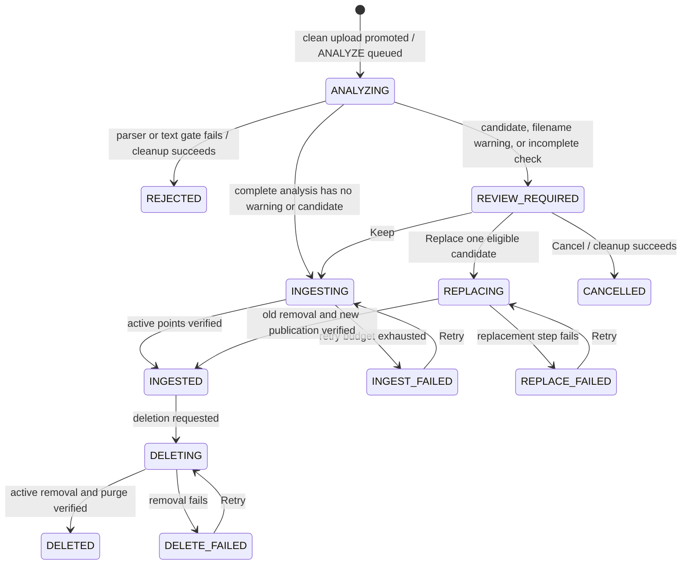

# Architecture and lifecycle

PDF Bridge is the durable control plane and ingestion owner for PDF retrieval. Operators, the
internal worker, provider endpoints, Qdrant, and the external retrieval service share stable UUID
and collection identities, but only Bridge mutates lifecycle state.

## Boundaries

| Component | Owns | Must not own |
|---|---|---|
| Browser/API | Upload, polling, evidence display, explicit decisions, retries, deletion requests | Parser/index mutations or inferred collection placement |
| PDF Bridge | Canonical bytes, catalog, analysis artifacts, decisions, audit hashes, outbox, Qdrant mutations | Chatbot-user authorization |
| ClamAV | Synchronous malware verdict | Parsing or lifecycle state |
| Parser subprocess | Page-mapped extraction under hard limits | Network access, indexing, decisions, or durable state |
| Embedding/LLM providers | Configured model inference | Candidate suppression or mutations |
| Qdrant | Active and screening vector persistence | Catalog authority |
| External retrieval | Keyword/semantic/hybrid query execution over active aliases | Screening access or document lifecycle mutation |

There is no batch API, handoff manifest, pipeline report, service token, or external job consumer.

## Persistence

SQLite is authoritative for:

- documents and terminal tombstones;
- durable work operations, attempts, leases, heartbeats, and visible phases;
- analysis revisions, page-mapped chunks, candidates, validated findings, and completeness;
- immutable Keep/Replace/Cancel decisions and replacement workflows;
- compressed-artifact pointers, ordered index outbox entries, collection epochs, and append-only
  audit events.

Canonical PDFs and compressed private analysis artifacts live beneath the configured storage root.
Heavy artifacts include extracted text, chunks, dense/sparse vectors, candidate snapshots, prompts,
and raw model output. Before purge, Bridge hashes a canonical manifest binding content, pipeline,
artifacts, decision, actor, target, and timestamps. Tombstones retain that hash and content-free
metadata, not excerpts, vectors, prompts, or raw output.

## Upload and analysis

Terminal `REJECTED`, `CANCELLED`, and `DELETED` rows are audit tombstones with no source,
analysis, or index content.

The synchronous upload path does only bounded streaming, hashing, format validation, ClamAV scan,
canonical promotion, and one short catalog transaction. It returns `202` as soon as `ANALYZE` is
durable. Parsing, inference, and Qdrant calls happen after the transaction closes.

The extraction child uses pinned pypdf with page and character limits inside the child; the parent
also enforces wall time, normalized-character and chunk budgets, and text-quality gates. Linux CPU
and address-space limits are defense in depth. This subprocess is not a complete parser sandbox.

## Candidate and review contract

All matching stays inside the selected logical collection. Exact byte duplicates are the sole
collection-scoped hard duplicate failure. Deterministic candidates include identical normalized
text, filename family, one dense score of at least `0.86`, scores of at least `0.72` across two
incoming chunks, or repeated strong BM25 placement. RRF orders candidates without combining raw
dense and sparse scores.

The top 12 deterministic candidates receive independent classifier and skeptical-verifier calls.
PDF excerpts are marked untrusted, tools are not offered, structured output is retried once, and
every chunk reference and quote is checked against retained source. LLM labels are explanatory only
and cannot remove a candidate, choose a replacement, or publish content. Qualifying overflow is
persisted and always forces review.

Reviews never expire. A decision names the exact analysis revision and is rejected if that revision
or collection epoch is stale. Keep records an advisory override. If publication providers remain
unavailable, the retained ingestion operation may be retried without another decision.

## Qdrant layout

Each logical collection has a physical collection named `pdf-bridge-{key}-v{epoch}` and a stable
alias equal to the collection key. Pending and not-yet-published points use the private
`pdf-bridge-screening-v1` collection. Point IDs are deterministic UUIDv5 values, and every point
contains both named vectors:

- `content_dense` for semantic search;
- `content_bm25` for keyword search.

Payloads include `schema_version`, `document_id`, `analysis_id`, `chunk_id`, `chunk_index`,
`collection_key`, page range, text hash, bounded text, `published`, and `screening`. Dense-only or
BM25-only points are never considered a complete publication.

SQL outbox entries make mutations durable. Qdrant calls use idempotent point IDs, wait for apply,
strong write ordering, and exact document point counts. A crash may repeat a mutation; reconciliation
must converge to the outbox and catalog state.

The Bridge credential is administrative because it owns collections and aliases. Self-hosted
Qdrant enables API authentication and JWT RBAC. Retrieval receives only a collection-scoped
read-only JWT covering active aliases; it receives no admin key and no permission for the screening
collection or collection-list operations beyond its scoped view.

## Replacement ordering

Replacement accepts exactly one candidate that is still `INGESTED` in the same collection.

1. Persist or regenerate the new document's complete dense and sparse analysis vectors without
   publishing them.
2. Delete the old document's active points with a durable outbox entry and verify an exact count of
   zero.
3. Purge the old source and analysis artifacts and commit its `DELETED` tombstone.
4. Publish and verify the new active points, then remove its screening points.
5. Mark the new document and replacement workflow successful.

An old-delete failure stops before step 3. A failure after verified old deletion leaves an explicit
availability gap and a retryable new-document operation; it never restores or overlaps the old
content automatically.

## Concurrency and recovery

Exactly one Uvicorn process owns a two-slot worker. SQL leases and heartbeats recover abandoned
`RUNNING` operations, while process-local per-collection locks serialize analysis and mutation of a
collection. Short transactions record each stage; no transaction spans parsing, embedding, LLM, or
Qdrant I/O.

This design deliberately does not support multiple app processes. Horizontal scaling requires a
different distributed-lock and collection-epoch design, plus a database appropriate for multiple
writers.

## Retrieval contract

The external search request and response shape remains stable: mode is `keyword`, `semantic`, or
`hybrid`, results remain grouped by collection, and hits return Bridge `document_id` and
`collection_key`. Keyword uses BM25, semantic uses dense vectors, and hybrid fuses the two rankings
with RRF. Every active query filters `published=true` and the current `schema_version`.

Bridge validates returned UUIDs against the catalog before showing operator search results. Pending,
screening, tombstoned, unknown, and cross-collection hits fail closed.

## Coordinated reset

The semantic-intake migration is empty-only. Cutover stops traffic, preserves source PDFs outside
Bridge, wipes the disposable SQLite/catalog storage and all old active/screening Qdrant collections,
deploys Bridge and retrieval together, and reingests through the normal analysis/review path. There
is no dual API or compatibility path.
