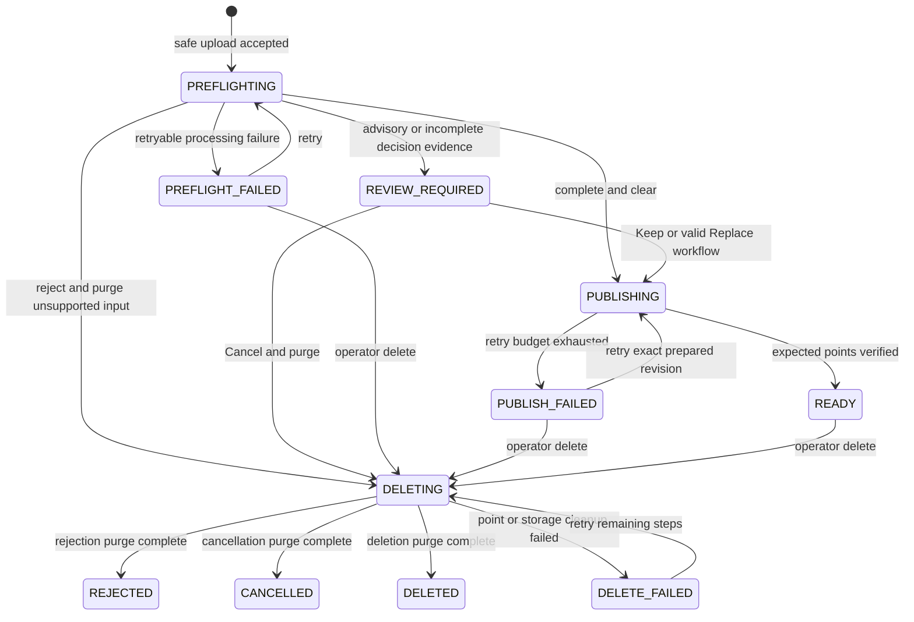

# Service contract

Status: Current

This is the canonical behavioral contract for the implemented PDF Bridge service. More specific
documents may add detail but must not weaken these invariants.

## Purpose and boundary

PDF Bridge is a storage facade for collection-based PDF stores. It gives operators one place to
upload, inspect, review, replace, and delete PDFs while owning the complete path from safe storage
to Qdrant publication.

PDF Bridge owns:

- opaque UUID source storage and the authoritative document catalog;
- native-text extraction, LLM Markdown formatting, chunking, and vector generation;
- duplicate screening and retained LLM classification/verifier checks as preflight;
- immutable operator decisions and direct Qdrant point mutation;
- document inspection, lifecycle history, retry, replacement, and verified deletion.

PDF Bridge does not own Qdrant collection provisioning, OCR, arbitrary document conversion,
metadata editing, or the external end-user retrieval product. Jenkins and any external ingestion
  consumer are absent from the runtime boundary.

## Terms

- **Collection**: a deployment-defined logical PDF store mapped one-to-one to a fixed Qdrant
  collection name. The mapping is immutable while the service is running.
- **Admission**: bounded upload streaming, hashing, PDF-shape validation, malware scanning, UUID
  promotion, and durable enqueue. It finishes with `202 Accepted` or no accepted document.
- **Preflight**: asynchronous work after admission and before active publication: native-text
  eligibility, extraction, Markdown formatting, chunking, embeddings, semantic screening,
  duplicate review, and LLM classification.
- **Prepared revision**: the immutable raw extraction, canonical Markdown, chunks, vectors,
  provenance, model/profile identifiers, hashes, candidate evidence, completeness result, and
  resolved fixed active Qdrant collection target from one successful preflight attempt.
- **Ingestion/publication**: writing an approved prepared revision to its configured active Qdrant
  collection and verifying the complete point set.
- **Ready**: the catalog and Qdrant agree that every expected chunk point is active. An accepted
  upload, successful parse, or successful upsert call alone is not readiness.
- **Tombstone**: content-free audit metadata retained after cancellation, rejection, replacement,
  or deletion. It contains identifiers, timestamps, hashes, disposition, and actor—not source
  bytes, text, Markdown, vectors, prompts, or model output.

## Collection and storage invariants

1. Collection definitions come only from deployment configuration. A definition contains a stable
   logical key, display metadata, and an explicit fixed Qdrant collection name.
2. PDF Bridge validates required Qdrant schemas at readiness. It never creates, deletes, renames,
   versions, or aliases a Qdrant collection.
3. Source objects retain the managed UUID-sharded key
   `objects/{uuid_prefix}/{document_uuid}.pdf`; generated artifacts are likewise addressed by
   service-generated UUIDs. Original filenames are metadata and can never determine a storage path.
4. A document belongs to exactly one collection for its entire lifecycle. Moving it means uploading
   a new document to the destination and deleting the old one.
5. Metadata is read-only after intake. There is no metadata patch endpoint or operator edit form.
6. Exact byte duplication is scoped to a logical collection. Advisory similarity never silently
   rejects, replaces, or publishes a document.

## Lifecycle

`REJECTED`, `CANCELLED`, and `DELETED` are terminal content-free states. `PREFLIGHT_FAILED`,
`PUBLISH_FAILED`, and `DELETE_FAILED` expose a sanitized failure code and a retry action when the
failure is retryable. Internal operations have their own queued/running/failed status; queue status
does not add document states. Rejection and cancellation use the same verified `DELETING` workflow
as operator deletion and do not enter their terminal state until content purge succeeds.

Upload returns `202 Accepted` after bounded validation, malware screening, durable UUID storage,
and enqueue. Work starts immediately without a scheduler or batch handoff. Two general worker slots
are sufficient for the expected load of roughly five queued documents, while all local MPNet calls
pass through one serialized embedding lane. Delete operations always outrank new preflight and
publication work.

## Preflight and approval

- Inputs must be English, native-text PDFs. Encrypted, malformed, image-only, text-insufficient,
  or over-limit files are rejected. OCR is never attempted.
- `pypdf` extracts page-scoped layout text. Bounded consecutive page groups are sent to the vLLM
  chat-completions endpoint; an oversized page is sent as ordered slices.
- The formatter must return strict page/slice-scoped JSON containing Markdown for every input.
  Missing, duplicated, reordered, invalid, or empty output fails the attempt. There is no raw-text
  fallback.
- Canonical Markdown is chunked with page and heading provenance. Dense and sparse document vectors
  are prepared before duplicate discovery and LLM classification.
- Deterministic matching remains authoritative evidence. LLM classifier/verifier output is
  advisory, cannot suppress a deterministic candidate, and cannot choose an action for the user.
- A decision names the exact prepared revision. Publication reuses that revision without parsing,
  formatting, chunking, or embedding again.

Keep approves the current revision despite advisory findings. Replace identifies one `READY`
document in the same collection; the old document's Qdrant points must reach verified zero before
the new revision can be published. Cancel purges unpublished source and generated artifacts and
leaves a tombstone.

## Qdrant publication and deletion

Every chunk point carries both `dense` and `bm25` named vectors. Active publication uses
deterministic point IDs and `wait=true`: it first stages the exact revision as
`published=false`/`visibility=publishing`, verifies the complete point set, opens the visibility
gate, verifies the active payload, and only then removes screening points and commits `READY`.
Partial vector sets or stale revisions fail publication.

Deletion is ordered and restart-safe:

1. Atomically set `DELETING`, hide content from all Bridge reads, and enqueue high-priority work.
2. Delete points by document UUID from the exact active collection persisted at successful
   publication and from the private screening collection, wait for application, and verify both
   counts are zero. Persist that physical target in every deletion checkpoint.
3. Purge the source PDF and all generated/preflight artifacts.
4. Remove content-bearing catalog rows, persist a tombstone, and set `DELETED`.

A Qdrant failure retains files for retry but keeps Bridge access blocked. A filesystem failure after
verified point deletion never republishes; retry resumes storage cleanup. Requests and retries are
idempotent.

## Operator experience and success criteria

Streamlit is the production-canonical operator UI and uses API v2 only. An operator can:

- browse configured collections and their current, pending, failed, and historical documents;
- inspect source metadata, state, preflight evidence, canonical Markdown, chunk boundaries,
  page/heading provenance, vector/profile identifiers, point counts, and audit events;
- upload to a selected collection, decide Keep/Replace/Cancel, retry eligible failures, and delete;
- optionally run operator-only diagnostic searches through Bridge's proxy to the separately owned
  retrieval service, without defining end-user ranking or authorization;
- never edit catalog metadata, access raw model credentials, or administer Qdrant collections.

The repository implements this contract: a clean upload can become `READY` without Jenkins, review
paths publish the exact inspected revision, deletion proves zero Qdrant points before removing
files, the Streamlit collection facade exposes the required inspection views, and API v1/Jinja
operator routes are absent. A deployment is not cut over merely because the code is complete; its
owners must still execute and record the coordinated reset, reingestion, reconciliation, security,
and release gates.
